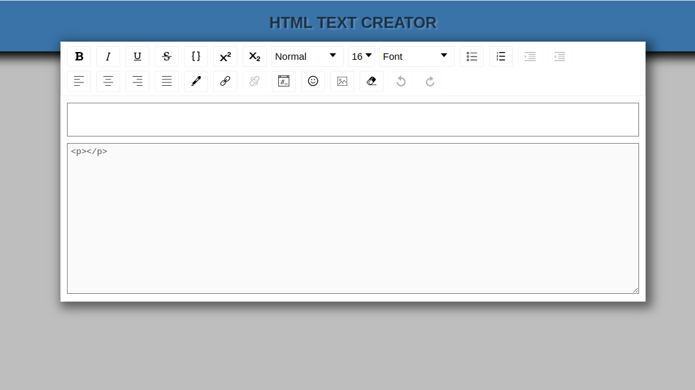
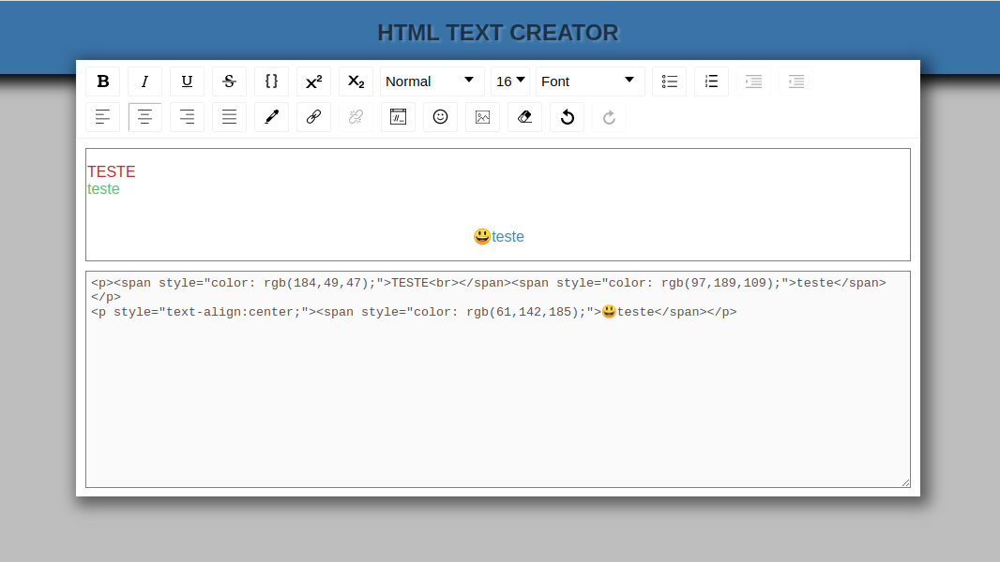
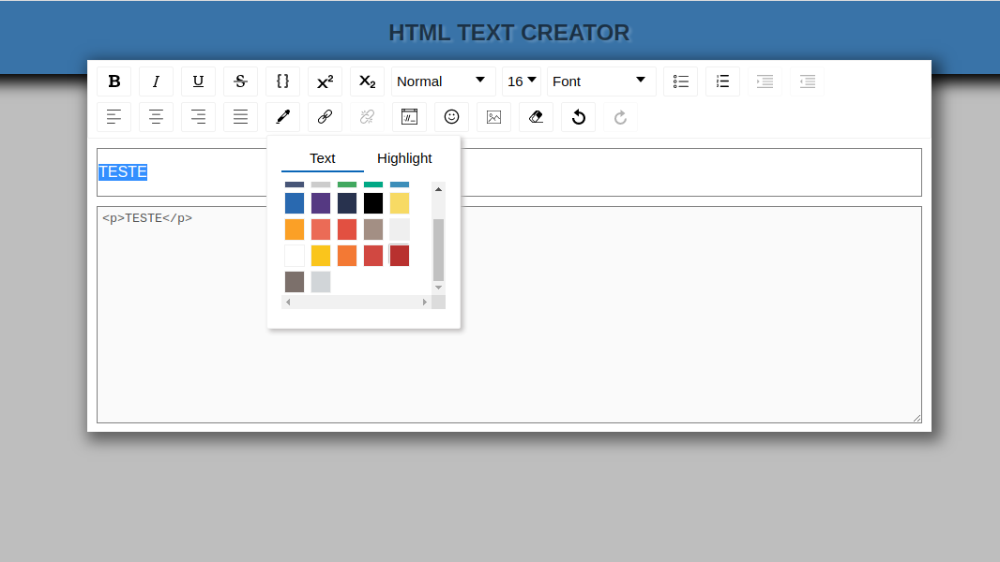

# HTML- TEXT EDITOR

<strong>Uma aplicação que auxilia a edição das estruturas de texto e images no HTML</strong>

Escreva o que quiser, escolha as opções de edição e receba o código em <strong>HTML</strong>!

  

  
  
  
  

